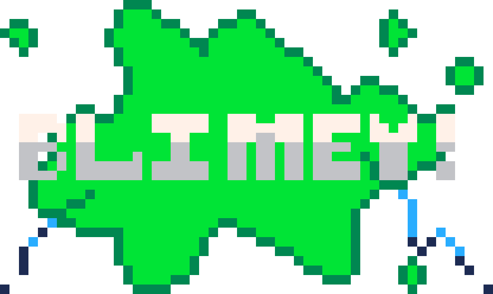

<a name="readme-top"></a>

<!-- PROJECT SHIELDS -->
<!--
*** I'm using markdown "reference style" links for readability.
*** Reference links are enclosed in brackets [ ] instead of parentheses ( ).
*** See the bottom of this document for the declaration of the reference variables
*** for contributors-url, forks-url, etc. This is an optional, concise syntax you may use.
*** https://www.markdownguide.org/basic-syntax/#reference-style-links
-->
[![Contributors][contributors-shield]][contributors-url]
[![Forks][forks-shield]][forks-url]
[![Stargazers][stars-shield]][stars-url]
[![Issues][issues-shield]][issues-url]
[![MIT License][license-shield]][license-url]


<!-- PROJECT LOGO -->
<br />
<div align="center">
  <a href="https://github.com/StrongSand94191/Blimey">
    
  </a>

  <h3 align="center">Blimey!</h3>

  <p align="center">
    A Celeste mod with many random features
    <br />
    <a href="https://github.com/StrongSand94191/Blimey"><strong>Explore the docs »</strong></a>
    <br />
    <br />
    <a href="https://www.lexaloffle.com/bbs/?tid=54017">Play</a>
    ·
    <a href="https://github.com/StrongSand94191/blimey/issues/new?assignees=StrongSand94191&labels=bug&projects=&template=bug_report.md&title=">Report Bug</a>
    ·
    <a href="https://github.com/StrongSand94191/blimey/issues/new?assignees=StrongSand94191&labels=enhancement&projects=&template=feature_request.md&title=">Request Feature</a>
  </p>
</div>


<!-- TABLE OF CONTENTS -->
<details>
  <summary>Table of Contents</summary>
  <ol>
    <li>
      <a href="#about-the-project">About The Project</a>
      <ul>
        <li><a href="#built-with">Built With</a></li>
      </ul>
    </li>
    <li>
      <a href="#getting-started">Getting Started</a>
    </li>
    <li><a href="#contributing">Contributing</a></li>
    <li><a href="#license">License</a></li>
    <li><a href="#contact">Contact</a></li>
    <li><a href="#acknowledgments">Acknowledgments</a></li>
  </ol>
</details>


<!-- ABOUT THE PROJECT -->
## About Blimey!

Blimey! is a mod of Celeste Classic based on Evercore that adds several mildly useful things.

For example:
* A pause menu with a settings screen
* A save system that can work with clipboard saves and local saves
* Music by [MetaHumanBoi](https://soundcloud.com/metahumanboi)
* Other random improvements such as nicer-looking infoboxes

Keep in mind this is my first major PICO-8 project, so don't expect my code to be anything other than an unreadable, unoptomized mess.

<p align="right">(<a href="#readme-top">back to top</a>)</p>


### Built With

[![Evercore][evercore-github]][evercore-url]
[![PICO-8][pico8-shield]][pico8-url]

<p align="right">(<a href="#readme-top">back to top</a>)</p>


<!-- GETTING STARTED -->
## Getting Started

To play this game, do any one of these things:
- Download the game from the Releases section and drag it into PICO-8 or PICO-8 Education
- Use the Splore function in PICO-8 and search for Blimey
- Type ```load blimey``` into the command line in PICO-8 or PICO-8 Education
- [Play it on Lexaloffle](https://www.lexaloffle.com/bbs/?tid=54017)

<p align="right">(<a href="#readme-top">back to top</a>)</p>


<!-- CONTRIBUTING -->
## Contributing

Contributions are what make the open source community such an amazing place to learn, inspire, and create. Any contributions you make are **greatly appreciated**.

If you have a suggestion that would make this better, please fork the repo and create a pull request. You can also simply open an issue with the tag "enhancement".
Don't forget to give the project a star! Thanks again!

1. Fork the Project
2. Create your Feature Branch (`git checkout -b feature/AmazingFeature`)
3. Commit your Changes (`git commit -m 'Add some AmazingFeature'`)
4. Push to the Branch (`git push origin feature/AmazingFeature`)
5. Open a Pull Request

<p align="right">(<a href="#readme-top">back to top</a>)</p>


<!-- LICENSE -->
## License

Distributed under the Unlicense License. See `LICENSE.txt` for more information.

<p align="right">(<a href="#readme-top">back to top</a>)</p>


<!-- CONTACT -->
## Contact

Email - strongsand94191@gmail.com

Project Link: [https://github.com/StrongSand94191/blimey](https://github.com/StrongSand94191/Blimey)

<p align="right">(<a href="#readme-top">back to top</a>)</p>


<!-- ACKNOWLEDGMENTS -->
## Acknowledgments

Crumbling block, dash refill, and monument texture: [Celeste Modern by starl1ght](https://www.lexaloffle.com/bbs/?tid=49639)<br>
Keyboard input function: [Real Keyboard Input by dw817](https://www.lexaloffle.com/bbs/?tid=31598)<br>
Code for pause menu: [Menu System + Palette Swapping Guide by PixelCod](https://www.lexaloffle.com/bbs/?tid=27725)<br>
Code minifier I used: [Shrinko8 by thisismypassword](https://www.lexaloffle.com/bbs/?tid=48591)<br>
Code for circular clipping function: [Lazy Devs’ video](https://www.youtube.com/watch?v=435tL1chJhI)<br>
Idea for dashless crystal: [@loadandcode](https://www.lexaloffle.com/bbs/?uid=63364)<br>
Music: [MetaHumanBoi](https://soundcloud.com/metahumanboi)<br>
Map editor used: [Everhorn](https://github.com/CelesteClassic/everhorn/releases)<br>
Resources and help: [Celeste Classic Discord](https://discord.gg/9Dm3NCS)<br>
Secret levels by [@micahc1113](https://www.lexaloffle.com/bbs/?uid=74548)<br>


<p align="right">(<a href="#readme-top">back to top</a>)</p>


<!-- MARKDOWN LINKS & IMAGES -->
<!-- https://www.markdownguide.org/basic-syntax/#reference-style-links -->
[contributors-shield]: https://img.shields.io/github/contributors/StrongSand94191/Blimey.svg?style=for-the-badge
[contributors-url]: https://github.com/StrongSand94191/Blimey/graphs/contributors
[forks-shield]: https://img.shields.io/github/forks/StrongSand94191/Blimey.svg?style=for-the-badge
[forks-url]: https://github.com/StrongSand94191/Blimey/network/members
[stars-shield]: https://img.shields.io/github/stars/StrongSand94191/Blimey.svg?style=for-the-badge
[stars-url]: https://github.com/StrongSand94191/Blimey/stargazers
[issues-shield]: https://img.shields.io/github/issues/StrongSand94191/Blimey.svg?style=for-the-badge
[issues-url]: https://github.com/StrongSand94191/Blimey/issues
[license-shield]: https://img.shields.io/github/license/StrongSand94191/Blimey.svg?style=for-the-badge
[license-url]: https://github.com/StrongSand94191/Blimey/blob/master/LICENSE.txt
[evercore-github]: https://img.shields.io/badge/Evercore-0f0f0f?logo=github&style=for-the-badge
[evercore-url]: https://github.com/CelesteClassic/evercore
[pico8-shield]: https://img.shields.io/badge/PICO--8-gray.svg?style=for-the-badge&logo=data:image/png;base64,iVBORw0KGgoAAAANSUhEUgAAACgAAAAoCAYAAACM/rhtAAAApElEQVR4Ae2dsQ2CUBRFH5QsQuhZQxsSwgCsYacmWrICtZUOoC5BwQBau8BzAC+E5P9EinNKAved5OXyWgOAeZIYIW4b1+HX4HwEEUQwpqD3JkVs+9YfjE89tKwXz03X/h9EEMFV3mL3XLf184gz9XjXMqfmx4cVI4hgzFtsr1q227NOvr4/3OTz3bnlFiOI4H9aPEFxcdnuoUqC81kxgggCQBhfqHwqM75sOVwAAAAQdEVYdExvZGVQTkcAMjAxMTAyMjHjWbbBAAAAAElFTkSuQmCC
[pico8-url]: https://www.lexaloffle.com/pico-8.php
